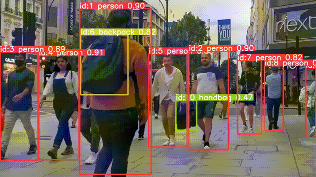

# Object Detection & Tracking — YOLOv8 + ByteTrack

[](https://www.python.org/downloads/)
[](https://ultralytics.com)
[](https://opensource.org/licenses/MIT)

A high-performance **Object Detection and Tracking** pipeline using the **YOLOv8** architecture and the **ByteTrack** multi-object tracking (MOT) algorithm. This project is designed for real-time video analysis with specific optimizations for **Apple Silicon (M-series)** hardware.

---

##  Project Overview

The goal of this project is to provide a robust framework for detecting and maintaining the identity of objects across video sequences. By combining the speed of YOLOv8 with the efficiency of ByteTrack, the pipeline handles complex scenarios such as occlusions and varying lighting conditions.


### Key Components
* **Detection:** YOLOv8 (Ultralytics) for state-of-the-art feature extraction.
* **Tracking:** ByteTrack algorithm for consistent ID association by leveraging low-confidence detection boxes.
* **Optimization:** Native support for **MPS (Metal Performance Shaders)** ensuring high FPS on Mac M1/M2/M3 chips.

---

## Demo & Visual Results

The following examples illustrate the core functionalities of the pipeline: object detection with YOLOv8 and multi-object tracking with ByteTrack.

---

### Object Detection — YOLOv8


*Single-frame object detection using YOLOv8, showing bounding boxes, class labels, and confidence scores.*

---

### Multi-Object Tracking — ByteTrack



*Multi-object tracking with persistent ID assignment across frames. ByteTrack maintains object identities during crossings and partial occlusions.*

---

> Although the input source is a prerecorded video, the pipeline runs at real-time capable speeds and is designed for live video stream deployment with minimal changes.


## Technical Architecture

The pipeline follows a two-stage approach:
1. **Inference Phase:** YOLOv8 processes each frame to produce bounding boxes and class probabilities.
2. **Association Phase:** ByteTrack analyzes the temporal sequence, matching detections to existing tracks using Kalman Filters and IoU (Intersection over Union) metrics.

### Hardware Acceleration
The system automatically detects the best available backend:
* **MPS:** For Apple Silicon GPUs.
* **CUDA:** For NVIDIA GPUs.
* **CPU:** Standard fallback for general environments.

---

## Repository Structure

```text
├── assets/
│   └── demo/                   # Demo images/GIFs (not versioned)
│       ├── detection_yolov8.jpg
│       └── tracking_bytetrack.gif
│
├── data/
│   ├── videos/
│   │   └── input.mp4           # Input video (not versioned)
│   └── output/                 # Output videos and tracking logs (generated)
│
├── models/                     # Local storage for model weights (.pt / .pth)
│
├── src/
│   ├── detect_video.py         # Object detection on video
│   ├── track_video.py          # Multi-object tracking with ByteTrack
│   ├── benchmark_fps.py        # FPS and performance benchmarking
│   └── utils.py                # Shared utilities (I/O, device selection)
│
├── requirements.txt            # Project dependencies
├── .gitignore
└── README.md                   # Project documentation

```

---

##  Performance & Benchmarking

Tests conducted on **Mac M2 (8GB RAM)** at **720p** resolution:

| Model | Variant | Mean FPS (CPU) | Use Case |
| :--- | :--- | :--- | :--- |
| **YOLOv8n** | Nano | ~41 | Real-time / Edge devices |
| **YOLOv8s** | Small | ~28 | Balanced Accuracy/Speed |
| **YOLOv8m** | Medium | ~22 | High-precision tracking |

### Analysis of Limitations
* **Occlusions:** Long-term full occlusion may lead to ID reassignment (ID switches).
* **Motion Blur:** High-speed movement in low light can degrade bounding box precision.
* **Small Objects:** Distant objects may be missed by the Nano model variant.

---

## 🚀 Getting Started

### 1. Installation & Environment
```bash
# Clone the repository
git clone https://github.com/leonardomagaraggia/Real-Time-Object-Detection-Tracking-with-YOLOv8
cd ObjectDetectionTracking

# Setup virtual environment
python3.10 -m venv venv
source venv/bin/activate

# Install dependencies
pip install -r requirements.txt
```

### 2. Run the Pipeline
**Object Detection:**
```bash
python src/detect_video.py
```

**Object Tracking (ByteTrack):**
```bash
python src/track_video.py
```

**Performance Profiling:**
```bash
python src/benchmark_fps.py
```

---

## Tech Stack & Dependencies

* **Frameworks:** `ultralytics` (YOLOv8), `torch` (PyTorch)
* **Computer Vision:** `opencv-python`, `Pillow`
* **Analytics:** `numpy`, `scikit-learn`, `matplotlib`
* **Hardware Support:** Apple Metal (MPS), NVIDIA CUDA

---

## Key Features

* **Dual-Stage Pipeline:** Seamless integration of detection and MOT logic.
* **Modular Source:** Decoupled scripts for detection, tracking, and benchmarking.
* **Real-Time Analytics:** Visual feedback with FPS counters and unique ID labels.
* **Error Handling:** Automated SSL fixes for macOS and flexible data pathing.

---

## 📜 License

Distributed under the **MIT License**. See the `LICENSE` file for more information.

---

**Developed by:** Leonardo Magaraggia
**GitHub:** [@leonardomagaraggia](https://github.com/leonardomagaraggia)
